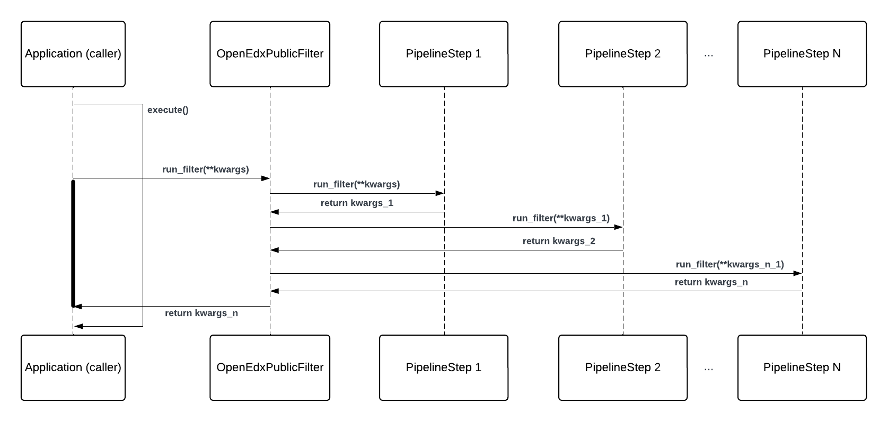

Open edX Filters
================

Overview
--------

Open edX filters provide a mechanism for modifying the platform's behavior by altering runtime data or halting execution based on specific conditions. Filters allow developers to implement application flow control based on their business logic or requirements without directly modifying the application code.

Throughout this document, we will refer to Open edX Filters as filters interchangeably.

What are Open edX Filters?
--------------------------

An Open edX Filter is a pipeline mechanism that executes a series of functions when configured. Each function receives input arguments, which are data used by the process in execution, and returns the same arguments, possibly modified. Given this design, filters can modify the application flow according to the specified configuration, altering or adding new behaviors during execution time.

The pipeline mechanism is implemented by a class called `OpenEdxPublicFilter`_, which provides the necessary tools to fulfill the Open edX Filters requirements, such as ordered execution, configurability, interchangeable functions, argument definition, and cumulative behavior. This enables filters to modify the flow of the application dynamically during runtime based on predefined business logic or conditions. We refer to the pipeline mechanism as the **Pipeline Tooling** throughout this document.

How do Open edX Filters work?
-----------------------------

Open edX Filters are implemented using an accumulative pipeline mechanism, which executes a series of functions in a specific order. Each function in the pipeline receives the output of the previous function as input, allowing developers to build complex processing logic by chaining multiple functions together. The pipeline ensures that the order of execution is maintained and that the result of a previous function is available to the current one in the form of a pipeline. In this diagram, we illustrate the workflow of Open edX Filters:

The workflow of Open edX Filters is as follows:

#. An application component (caller) invokes the filter by calling the ``run_filter()`` method implemented by the filter definition.

#. The ``run_filter`` method calls the **Pipeline Tooling** under the hood, which manages the execution of the filter's pipeline.

#. The filter's tooling retrieves the configuration from ``OPEN_EDX_FILTERS_CONFIG``, which defines a list of N functions :math:`f_1, f_2, \ldots, f_{n}` that will be executed.

#. The tooling then executes each function in the pipeline sequentially, starting with :math:`f_1`, which processes the input arguments and applies the developer's operations, returning potentially modified arguments.

#. The next function (if there are more than one) :math:`f_2` receives the potentially modified arguments and applies further operations, returning another modified set of arguments. This process continues through the list of functions.

#. Each subsequent function receives the output from the previous function and returns its modified output until all functions have been executed.

#. Additionally, at any point in the pipeline, a developer can halt execution by raising an exception, based on conditions defined in the processing logic, to stop the application flow.

#. Once the final function :math:`f_{n}` has been executed, the final modified arguments are returned to the caller, which may use them for the remaining part of its execution.

Each function in the pipeline has the ability to modify the input data, add new data, or halt execution based on specific conditions, such as raising exceptions if certain criteria is not met. This pipeline structure ensures that complex business logic can be applied during runtime without directly altering the application code.

Here's an example of a filter in action:

#. A user enrolls in a course, triggering the `CourseEnrollmentStarted filter`_ by calling the ``run_filter`` method with the enrollment details. This filter processes information about the user, course, and enrollment details.

#. The filter tooling executes a series of functions configured in ``OPEN_EDX_FILTERS_CONFIG``, e.g. checking user eligibility for enrollment, updating the enrollment status, and notifying the user about the enrollment.

#. Each function can modify the input data or halt the process based on business logic, e.g. denying enrollment if the user is ineligible.

#. The final output of the pipeline, such as the updated enrollment details, is returned to the caller, or an exception is raised if the user is not eligible.

#. The process is complete once all functions in the pipeline have executed, and the enrollment process continues based on the final output.

By organizing this workflow through a pipeline, Open edX Filters allow developers to extend platform functionality in a flexible and maintainable way.

How are Open edX Filters used?
------------------------------

Developers can implement functions in an `Open edX Django plugin`_, configure them for a particular filter in the ``OPEN_EDX_FILTERS_CONFIG`` setting, and modify the application flow when a the filter in question is invoked by the process in execution. These functions can the application's behavior by altering data, adding new data, or stopping execution by raising exceptions. For example, a filter can stop a student's enrollment if certain conditions, such as business rules, are not met.

For more information on how to use Open edX Filters, refer to the `Using Open edX Filters`_ how-to guide.

.. _Using Open edX Filters: ../how-tos/using-filters.html
.. _Hooks Extension Framework: https://open-edx-proposals.readthedocs.io/en/latest/oep-0050-hooks-extension-framework.html
.. _Django Signals Documentation: https://docs.djangoproject.com/en/4.2/topics/signals/
.. _CourseEnrollmentStarted filter: https://github.com/openedx/edx-platform/blob/master/common/djangoapps/student/models/course_enrollment.py#L719-L724
.. _Python Social Auth: https://python-social-auth.readthedocs.io/en/latest/pipeline.html
.. _OpenEdxPublicFilter: https://github.com/openedx/openedx-filters/blob/main/openedx_filters/tooling.py#L14-L15
.. _Open edX Django plugin: https://edx.readthedocs.io/projects/edx-django-utils/en/latest/plugins/readme.html
