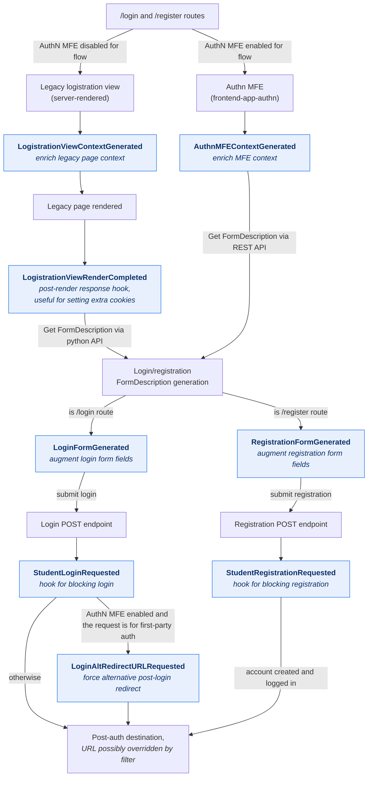

# 8. The authentication architecture subdomain

## Status

Accepted

## Context

Filters are grouped by architecture subdomain (see
[ADR-4](0004-filters-naming-and-versioning.rst)).
Until now, the filters covering how users sign in and register —
`StudentLoginRequested` and `StudentRegistrationRequested` — have lived in the
`learning` subdomain, because that was the only user-facing subdomain available
at the time.

A new set of filters covering the login and registration *user experience* is
being introduced: hooks around the login/registration page context and render
lifecycle, the login and registration form descriptions, the authentication MFE
(`frontend-app-authn`) context, and the post-login redirect. These needed a
home, and `learning` is a poor fit: authentication gates access for *every* user
of the platform — learners and content authors alike — so it is a distinct
bounded context rather than a learning activity.

## Decision

We will introduce a new "Authentication" architecture subdomain, implemented in
`openedx_filters/authentication/` with filter types under
`org.openedx.authentication.*`. From now onward, new authentication-related
filters should be added here.

Docs: This new subdomain will be added to the [Architecture Subdomains Reference](../reference/architecture-subdomains.rst)
alongside "Learning" and "Content Authoring".

The following filters are added to it:

- `LogistrationViewContextGenerated` — enrich the legacy (server-rendered) login/registration page context.
- `LogistrationViewRenderCompleted` — modify the rendered legacy login/registration page response.
- `AuthnMFEContextGenerated` — enrich the authentication MFE context.
- `LoginFormGenerated` — augment the generated login form description.
- `RegistrationFormGenerated` — augment the generated registration form description.
- `LoginAltRedirectURLRequested` — choose an alternative post-login redirect.

The diagram below shows when each authn-related filter fires within the authn flow.

## Consequences

- Future authentication-related filters have a clear, accurately named home and
  no longer need to borrow the "Learning" subdomain.
- The pre-existing authn filters `StudentLoginRequested` and
  `StudentRegistrationRequested` filters **remain in the `learning` subdomain**.
  They are released, versioned public contracts, and re-homing them would be a
  breaking change for existing consumers. A future major version could migrate
  the two longstanding filters.
